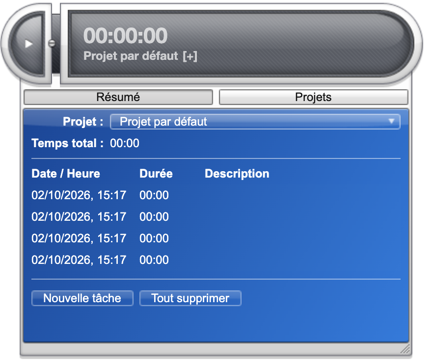

# Time Vault

A desktop time tracker: click play when you start a task, click it again when you finish.

This is an Electron port of **[Time Vault](https://web.archive.org/web/20111117181924/http://widgets.yahoo.com/widgets/time-vault/csort/new/cpage/1)**, a Yahoo! Widget originally released in 2007. The widget engine it was written for was discontinued in 2012, taking the widget with it. The port runs the original code — skin, animations and all — on a modern runtime.



## What it does

From the original description:

> This is a free time tracker widget. Click on the play button when you start a task and click it once again when you have finished.
>
> The tasks are grouped by projects and can be viewed by clicking on the arrow button. You can also edit or delete a task by right-clicking on it.
>
> The Widget will automatically publish and maintain Excel-compatible files containing the list of your tasks. You can customize these files by right-clicking the Widget and selecting Preferences > Reports

Projects carry a time budget, notes and a rate per hour, and can be archived once finished. The current task is auto-saved every minute, so a crash or a power cut costs you at most that. Four colour schemes, and localisation in English, French and Turkish.

## Using it

| | |
|---|---|
| **Start / stop** | the play button, `Cmd-T`, or the tray |
| **Open the drawer** | the arrow button, or `Cmd-D` |
| **Change project** | the dropdown in the drawer |
| **Pick a task** | the `[+]` next to the project name |
| **Edit or delete a task** | right-click it in the list |
| **Reports, always-on-top** | right-click the widget |
| **Move it** | drag any part of the skin |
| **Resize it** | drag the round button on the right |
| **Zoom** | `Cmd-+` / `Cmd--` / `Cmd-0`, or right-click the widget |

Your data lives in a `TimeVault` folder — `~/Library/Application Support` on macOS, `%APPDATA%` on Windows, `~/.config` on Linux. `Events.db3` is a plain SQLite file, and CSV reports are written beside it. Databases from the original widget open unchanged.

## Syncing to Joplin

TimeVault can keep a **Time Vault** notebook in Joplin up to date with your projects and entries.

Turn it on in **Preferences → Joplin**, with Joplin running and its Web Clipper service enabled (Joplin → Settings → Web Clipper). Joplin will ask you to authorise TimeVault — the request appears inside the Joplin window, so bring it to the front if you don't see it. After that everything is automatic: it syncs whenever your data changes, and never shows a dialog.

The sync is **one way**. Those notes are rewritten from TimeVault every time, so anything you edit in Joplin is lost.

## Development

### Running it

Requires Node and a working `npm`.

```bash
cd app
npm install
npm start
```

```bash
npm test          # the full suite
npm run test:shim # the compatibility layer only
npm run test:app  # tests that boot the whole widget
```

### How the port works

The original is about 10,700 lines of JavaScript written against [Konfabulator](https://en.wikipedia.org/wiki/Yahoo_Widgets), the Yahoo! Widgets runtime: roughly 8,200 lines of widget plus the 2,500-line WidGUI toolkit it loads at startup.

Almost none of it was rewritten. Instead `app/src/shim/` reimplements the Konfabulator runtime over the DOM — its drawing primitives, preferences, filesystem, SQLite, dialogs and menus — so the original layout and animation code runs largely unchanged. Three edits were made to the ported source: one name collision, and two mechanical rewrites of syntax no standard JavaScript engine accepts.

```
Contents/     the original widget, frozen — the reference
PSD/          source artwork
TrayIcon/     the original tray icon art
app/          the port
  src/shim/   the Konfabulator compatibility layer
  src/widget/ ported copies of Contents/*.js
  src/widgui/ ported copies of the WidGUI toolkit
```

`CLAUDE.md` documents the compatibility traps worth knowing about before changing anything — several cost real time to find, and most fail silently rather than erroring.

### What's different from the original

Deliberate changes, all because Konfabulator provided something Electron doesn't, or vice versa:

- **Window dragging, click-through and auto-sizing** are implemented here. The engine used to supply them, so the widget never had its own.
- **The tray icon** is Electron's, replacing a Windows-only AutoHotkey executable. It now also shows whether the timer is running — the original's was a liveness watchdog that never changed.
- **Always on top** is a new preference, off by default, on the widget's right-click menu. Konfabulator floated widgets and offered the choice in its own menu, so the widget never had one.
- **Preferences** render in their own window rather than the engine's, built from the same declarations in the original `.kon` manifest.
- **Joplin sync** is new, and optional — see above.
- **Zoom** is new. The widget is 1x artwork at fixed pixel coordinates, which is small on a modern display; scaling the stage magnifies everything while the layout code carries on in the original coordinates. The artwork is bitmap, so it interpolates — the PSDs are in the repo if sharper assets are ever wanted.

## Licence

GPL-2.0-or-later, as the original. Copyright (c) Laurent Cozic, 2007–2026.
